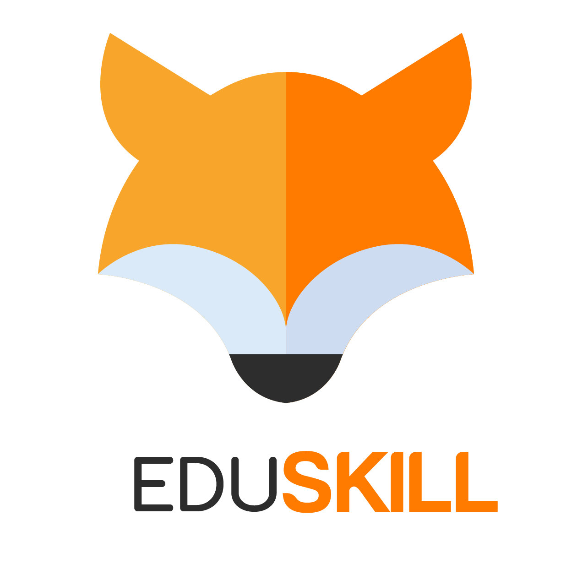

<p align="center"><a href="#" target="_blank"></a></p>

<p align="center">
<a href="https://github.com/laravel/framework/actions"></a>
<a href="https://packagist.org/packages/laravel/framework"></a>
<a href="https://packagist.org/packages/laravel/framework"></a>
<a href="https://packagist.org/packages/laravel/framework"></a>
</p>

## Eduskill Project

This is a Laravel Jetstream project that provides a foundation for building web applications with the latest Laravel features. It comes pre-configured with Jetstream, Livewire, and other essential tools.

## Prerequisites
Before you begin, ensure that you have the following installed on your machine:

- PHP (recommended version: 8.1 or higher)
- Composer
- Node.js (recommended version: 18.x or higher)
- NPM or Yarn

## Installation
1. Clone the repository
    ```
    git clone https://github.com/riikuid/eduskill.git
    ```
    
3. Change into the project directory
    ```
    cd eduskill
    ```
    
5. Install PHP dependencies
   ```
   composer install
   ```
   
7. Copy the .env.example file to .env and configure the database connection:
   ```
   cp .env.example .env
   ```
   Update the database configuration in the .env file with your database credentials.
   
9. Generate an application key:
    ```
    php artisan key:generate
    ```
    
11. Migrate the database:
    ```
    php artisan migrate
    ```
    
13. Install Node.js dependencies:
    ```
    npm install
    ```
    
15. Compile assets:
    ```
    npm run dev
    ```

## Running The Application
To start the development server, run the following command:

Visit http://localhost:8000 in your browser to view the application.

## Additional Configuration
For additional configuration options and features, refer to the [Laravel Jetstream ](https://jetstream.laravel.com/) documentation.

## License
The Laravel framework is open-sourced software licensed under the [MIT license](https://opensource.org/licenses/MIT).
